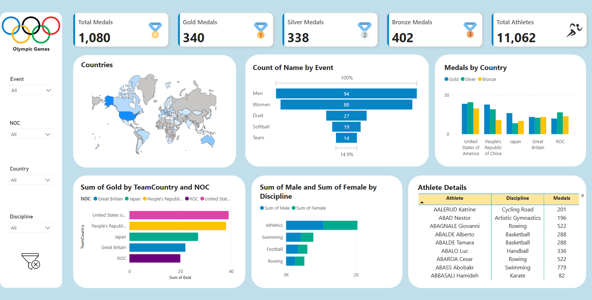

# 🏅 Olympics Data Pipeline Using Azure & Delta Lake

## 📌 Overview

This project implements an end-to-end data pipeline using **Azure services** and **Delta Lake** for analyzing **Olympics data**. The data processing follows the **Medallion architecture** (Bronze, Silver, and Gold layers) to ensure:  
✅ **Data integrity**  
✅ **Version control**  
✅ **Efficient transformations**  

The final insights are visualized in **Power BI** with **advanced DAX measures** for dynamic data exploration.  

---

## 🏆 Problem Statement

Analyzing Olympics data requires a structured pipeline that ensures:  
- **Accuracy** – Handling missing values, duplicates, and incorrect data types.  
- **Version Control** – Maintaining historical data with Delta Lake.  
- **Scalable Processing** – Using **Azure Data Factory, Databricks & PySpark** for big data transformations.  

### **Objectives**
✅ Efficiently ingest & clean raw Olympics data.  
✅ Process and transform data for insightful analysis.  
✅ Generate key performance metrics using DAX in Power BI.  
✅ Visualize trends such as country-wise medal distribution and gender-based participation.  

---

## 📊 Analysis & Key Insights

- **Medal Distribution**: The **United States** won the most **gold medals**, followed closely by **China** and **Japan**.  
- **Gender Participation**: **Athletics** had the highest **gender-balanced** participation, while **artistic swimming** was dominated by **female athletes**.  
- **Top Performing Countries**: Countries like **U.S., China, and Great Britain** consistently lead in **total medal counts**.  
- **Trend Analysis**: Power BI dashboards allow **dynamic exploration** of trends across **disciplines and years**.  

---

## 🚀 Tech Stack

| Category         | Tools & Technologies |
|-----------------|---------------------|
| **Cloud Services** | Azure Data Factory, Azure Data Lake, Databricks |
| **Processing** | PySpark, SQL, Delta Lake |
| **Visualization** | Power BI, DAX |
| **Data Formats** | CSV, Parquet, JSON |

---

## 🏗️ Architecture

### **Medallion Architecture Implementation**

#### **Bronze Layer (Raw Data)**
- Data ingestion from Azure Data Lake (CSV format).
- Storage in a raw zone without modifications.

#### **Silver Layer (Cleansed Data)**
- Data transformation using PySpark.
- Casting data types, handling missing values, and schema enforcement.
- Stored in Parquet format.

#### **Gold Layer (Analytical Data)**
- Aggregation and business logic implementation.
- Optimized data for Power BI visualization.

```python
# Writing data to Delta Lake in Gold Layer

df_ath.write.format('delta').mode('append').option('path', f'{gold}/Delta/Athletes').saveAsTable('Athlete')
df_Coaches.write.format('delta').mode('append').option('path', f'{gold}/Delta/Coaches').saveAsTable('Coaches')
df_EntriesGender.write.format('delta').mode('append').option('path', f'{gold}/Delta/EntriesGender').saveAsTable('EntriesGender')
df_Medals_1.write.format('delta').mode('append').option('path', f'{gold}/Delta/Medals').saveAsTable('Medals')
df_Teams.write.format('delta').mode('append').option('path', f'{gold}/Delta/Teams').saveAsTable('Teams')
```

---

## 🛠️ Delta Lake: Time Travel, Versioning & ACID Transactions

### **Time Travel in Delta Lake**
Delta Lake enables time travel, allowing users to query previous versions of data.

```sql
-- View the history of a table
DESCRIBE HISTORY Medals;
```

```python
# Querying a previous version using PySpark
previous_version = spark.read.format("delta").option("versionAsOf", 2).load(f"{gold}/Delta/Medals")
previous_version.show()
```

### **Versioning in Delta Lake**
Every change to a Delta table is stored as a new version, maintaining data lineage and reproducibility.

```python
# Get the latest version number
latest_version = spark.sql("SELECT max(version) FROM (DESCRIBE HISTORY Medals)")
print(f"Latest Version: {latest_version}")
```

### **ACID Transactions & Schema Evolution**
Delta Lake ensures **ACID compliance** (Atomicity, Consistency, Isolation, Durability) and supports schema evolution.

```sql
-- Enforce schema constraints and enable column mapping
ALTER TABLE Athlete
SET TBLPROPERTIES (
    'delta.minReaderVersion' = '2',
    'delta.minWriterVersion' = '5',
    'delta.columnMapping.mode' = 'name'
);
```

---

## 📊 Power BI Dashboard

- **Total Medals**: `SUM(Medals[Total])`
- **Gold Medals**: `SUM(Medals[Gold])`
- **Silver Medals**: `SUM(Medals[Silver])`
- **Bronze Medals**: `SUM(Medals[Bronze])`
- **Total Athletes**: `CALCULATE(DISTINCTCOUNT('Athletes'[Name]))`

---

This structured approach ensures efficient processing, data integrity, and insightful analysis of Olympics data. 🚀
