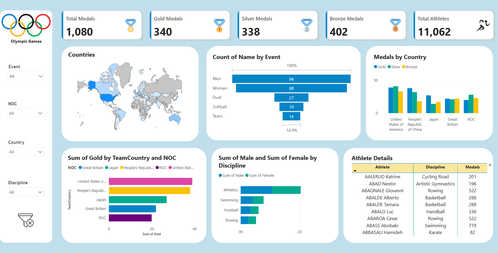
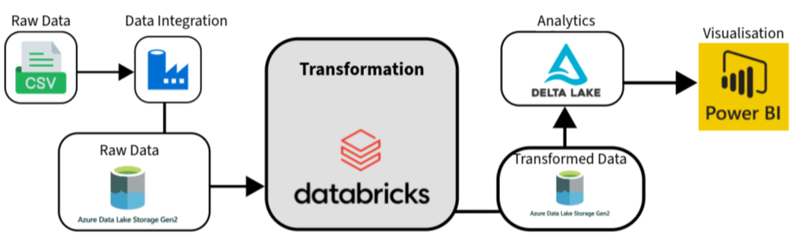

# 🏅 Azure Olympics Trend & Comparative Analysis

---

## 📌 Navigation  

| Section | Link |
|---------|------|
| **Part 1 – Data Analysis** | [Go to Data Analysis](#-part-1-data-analysis--exploratory--diagnostic-insights) |
| **Interactive Dashboard** | [View Dashboard](#-power-bi-dashboard) |
| **Part 2 – Data Engineering & Pipeline** | [Go to Data Engineering](#-part-2-data-engineering--azure-pipeline-with-delta-lake) |

---

## 🔹 Part 1: Data Analysis – Exploratory & Diagnostic Insights  

### 📌 Problem Statement  
The Olympic Games bring together athletes from across the world, but understanding long-term **participation patterns**, **athlete demographics**, and **medal outcomes** requires more than raw numbers.  

This analysis seeks to answer:  
- How has athlete participation evolved across decades?  
- What role do **age, height, and weight** play in performance?  
- How have **gender dynamics** changed over time?  
- Which countries and sports dominate the Olympic landscape?  

The challenge lies in structuring the raw dataset into **insightful trends and comparisons** that reveal both historical and sporting narratives.  

---

### 📌 Overview  
The **Gold Layer dataset (70K+ athlete records, 1896–2016)** was analyzed using **Colab (Python, Pandas, Seaborn, Matplotlib)** and visualized in **Power BI**.  

The analysis followed a flow of:  
1. **Cleaning & preprocessing**  
2. **Exploratory Data Analysis (EDA)**  
3. **Descriptive insights** (what happened)  
4. **Diagnostic insights** (why it happened)  

This narrative also aligns with the [LinkedIn Post (Slides)](https://www.linkedin.com/feed/update/urn:li:activity:7372879294664036352/), which presented the results as a visual storytelling sequence.  

---

### 🧪 Notebook Breakdown (eda_olympics.py)  

#### 1. Data Import & Cleaning  
- Imported `dataset_olympics.csv`  
- Used `data.info()` and `describe()` to inspect schema  
- Found missing values in **Height/Weight**, handled accordingly  
- Removed duplicates with `drop_duplicates()`  

👉 *Why*: Clean data ensures accuracy and avoids inflated participation counts.  

#### 2. Univariate Analysis  
- **Gender Distribution** → Early Olympics male-dominated; female athletes steadily increased post-1920.  
- **Age Distribution** → Most athletes aged 20–30; peak around 24–26 years.  
- **Height/Weight** → Spread highlighted physical diversity across sports.  
- **Medal Counts** → Bronze > Silver > Gold due to dual bronze medals.  

👉 *Why*: Establishes baseline athlete demographics.  

#### 3. Bivariate Analysis  
- **Year vs Medal** → Medal counts rose as events expanded.  
- **Height vs Weight by Medal** → Showed natural athlete clusters (light gymnasts vs heavy wrestlers).  
- **Season vs Age** → Summer athletes younger; Winter athletes older.  
- **Medal vs Height** → Violin plots revealed medalist body profiles.  

👉 *Why*: Connects physical attributes with success.  

#### 4. Group-Level Analysis  
- **Average Age by Year** → Rising trend across decades.  
- **Median Height by Sport** → Basketball/Volleyball tallest, Gymnastics shortest.  
- **Medals by Country** → USA, USSR/Russia, and China consistently at the top.  
- **Country Avg Age** → China fields younger gymnasts; Europe older endurance athletes.  

👉 *Why*: Links countries’ strategies with athlete profiles.  

#### 5. Sport-Level Trends  
- **Unique Events** → Athletics & Swimming had the most.  
- **Wrestling Gender Gaps** → Female wrestlers significantly lighter.  
- **Participation Growth** → Exponential increase after WWII and Cold War.  

👉 *Why*: Reflects how Olympic expansion shaped opportunities.  

#### 6. Highlights (Extreme Values)  
- **Tallest Athlete** → Over 2.2m tall, basketball player.  
- **Heaviest Athlete** → Over 200kg, weightlifting.  

👉 *Why*: Outliers illustrate diversity in athlete builds.  

#### 7. Medals Heatmap  
- Pivot table → medals by **Country × Year**  
- Heatmap showed:  
  - USA dominance post-WWII  
  - China’s rise post-1980s  
  - USSR/Russia dominance until 1990s  

👉 *Why*: Visualizes geopolitical shifts in sports.  

---

### 📈 Descriptive & Diagnostic Insights  

- **Descriptive**  
  - Participation surged across decades  
  - Gender gap closed significantly post-1970s  
  - USA, USSR, China dominated overall medal counts  

- **Diagnostic**  
  - **Why USA dominates** → Broad participation across disciplines  
  - **Why gymnastics skews younger** → Flexibility peak at younger ages  
  - **Why gender gap shrank** → IOC reforms & women’s events inclusion  

---

### 📸 Power BI Dashboard  

  

The dashboard enabled dynamic exploration of:  
- **Medal distribution by country**  
- **Gender participation evolution**  
- **Sport-level demographics**  
- **Comparative trends across decades**  

---

## 🔹 Part 2: Data Engineering – Azure Pipeline with Delta Lake  

### 📌 Problem Statement  
Raw Olympic datasets are **large, inconsistent, and evolving**. Building reliable analytics requires a pipeline that:  
- Handles missing values & schema drift  
- Maintains historical versions of data  
- Supports scalable transformations for big data  
- Prepares clean datasets for visualization and ML  

---

### 📌 Overview  
The pipeline was built with **Azure Data Factory, Databricks, and Delta Lake**, following the **Medallion Architecture (Bronze → Silver → Gold)**.  

This ensures:  
- **Data integrity** (clean, deduplicated, standardized)  
- **Version control** (Delta Lake time travel)  
- **Optimized queries** for analytics  

---

### 🏗️ Architecture  

  

- **Bronze Layer (Raw Data)**  
  - Ingested Kaggle CSVs into Azure Data Lake  

- **Silver Layer (Cleansed Data)**  
  - Used PySpark in Databricks  
  - Schema enforcement, null handling, deduplication  
  - Stored as Parquet  

- **Gold Layer (Business Data)**  
  - Aggregated & enriched data  
  - Written to Delta Tables for Power BI  

---

### 💾 Sample PySpark Transformation  

```python
# Writing data to Delta Lake in Gold Layer
df_ath.write.format('delta').mode('append').option('path', f'{gold}/Delta/Athletes').saveAsTable('Athlete')
df_Medals_1.write.format('delta').mode('append').option('path', f'{gold}/Delta/Medals').saveAsTable('Medals')
```

---

### ⚡ Delta Lake Features  

- **Time Travel & Versioning**  
```sql
DESCRIBE HISTORY Medals;
```

- **ACID Transactions & Schema Evolution**  
```sql
ALTER TABLE Athlete
SET TBLPROPERTIES (
  'delta.minReaderVersion' = '2',
  'delta.minWriterVersion' = '5',
  'delta.columnMapping.mode' = 'name'
);
```

👉 *Why*: Ensures reproducibility and reliable concurrent updates.  

---

## ✅ Conclusion  

This project demonstrates a **two-part approach**:  

- **Part 1 – Data Analysis**: In-depth EDA and diagnostic analysis (Python + Power BI) revealing patterns in participation, demographics, gender evolution, and medal dominance.  
- **Part 2 – Data Engineering**: Scalable Azure + Delta Lake pipeline ensuring clean, versioned, and business-ready datasets.  

Together, they form a **full-stack data project** — from ingestion to insights 🚀  
